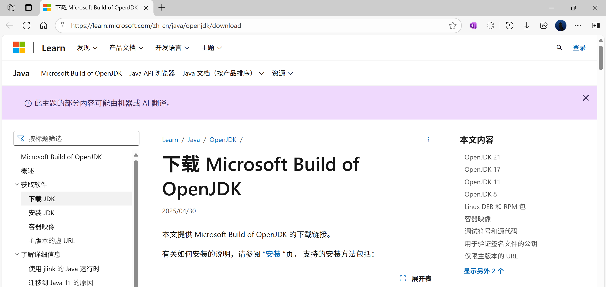
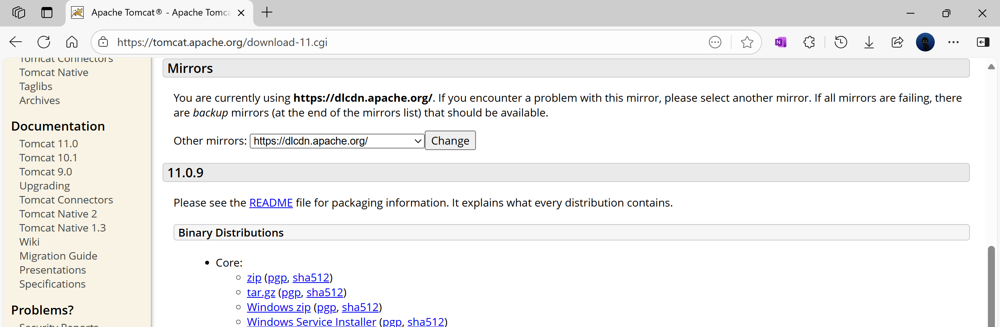
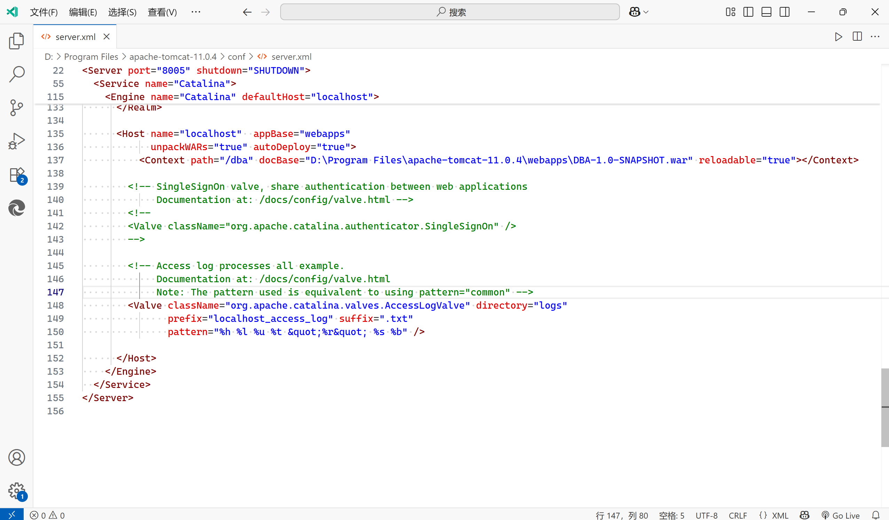

# 高校学生成绩管理系统开发与运行

开发平台为 Microsoft OpenJDK 21.0.7和 IntelliJ IDEA Ultimate 2025.1，搭载 Tomcat 11.0.4 同华为云 GaussDB 交互。

开发环境为 Windows 11 25H2 (Windows NT 10.0.26200) 和 Microsoft Edge 140.0。

[Microsoft JDK 21.0.7](https://aka.ms/download-jdk/microsoft-jdk-21.0.7-windows-x64.msi)

以管理员用户打开，勾选配置 Java 路径。

[Windows Service Installer](https://dlcdn.apache.org/tomcat/tomcat-11/v11.0.8/bin/apache-tomcat-11.0.8.exe)

安装最新版 Tomcat。

[JDBC](https://opengauss.obs.cn-south-1.myhuaweicloud.com/6.0.1/openEuler22.03/arm/openGauss-JDBC-6.0.1.tar.gz)

安装 GaussDB JDBC 驱动。

本数据库系统设置了简易的服务器部署方式，只须将 target\DBA-1.0-SNAPSHOT.war 复制到 [Tomcat 安装目录]\webapps 下，在安装目录\conf\Server.xml 的 Host 标签中中添加如下语句：

`<Context path="/dba" docBase="[安装目录]\webapps\DBA-1.0-SNAPSHOT.war" reloadable="true"></Context>`

然后打开安装目录\bin\startup.bat

Tomcat 会自动解压缩 war 包，浏览器打开 localhost:8080/dba/ 即可运行。